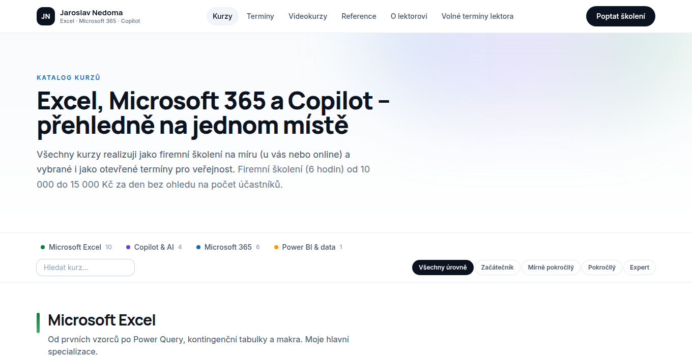

# lektornedoma.cz – nová generace webu

Osobní web lektora **Jaroslava Nedomy** (Excel · Microsoft 365 · Copilot) s vlastní administrací.



## Co web umí

**Veřejná část**

| Stránka | Popis |
|---|---|
| `/` | Úvod postavený na osobě lektora: čísla (účastníci, kurzy, dny), oblasti Excel / Copilot & AI / Microsoft 365 / Power BI, Copilot spotlight, doporučené kurzy, reference, nejbližší termíny, videokurzy |
| `/kurzy` | Přehledný katalog rozdělený do oblastí, filtr podle úrovně a vyhledávání |
| `/kurzy/[slug]` | Detail kurzu – osnova, pro koho, cena, otevřené termíny, poptávka pro firmu |
| `/terminy` | Veřejné termíny po měsících; **partnerské termíny** jsou barevně odlišené a vedou na přihlášku u partnera |
| `/objednavka/[id]` | Přihláška na termín (počet osob, fakturační údaje, výpočet ceny) |
| `/videokurzy` | Nabídka videokurzů a jejich objednávka (samotné kurzy běží na externím portálu) |
| `/reference` | Reference firem (zeď log/názvů + vyjádření) a hodnocení jednotlivých účastníků |
| `/o-lektorovi` | Profil lektora |
| `/poptavka` | Poptávkový formulář (firemní / individuální / konzultace) |
| `/kalendar` | **Rezervační kalendář lektora** – volné / zablokované / obsazené dny, výběr kurzu a místa konání, vícedenní rezervace |

**Administrace (`/admin`)**

- **Přehled** – nepotvrzené rezervace (potvrzení jedním klikem), nové poptávky a objednávky, honoráře v měsíci, nejbližší školení.
- **Kalendář lektora** – měsíční mřížka; každý den lze ručně označit jako *volno / obsazeno / zablokováno* s poznámkou, hromadně označit rozsah (dovolená). Rezervace z webu přicházejí jako *nepotvrzené* a den je na webu zablokovaný, dokud je nepotvrdíte nebo nezamítnete. U rezervace evidujete klienta, místo, kurz, **domluvený honorář**, poznámky, potvrzení; upozornění na kolize.
- **Poptávky** – stavy (nová → řeším → nabídka odeslána → realizováno / nerealizováno), interní poznámky, převod poptávky na rezervaci v kalendáři.
- **Objednávky** – přihlášky na termíny i nákupy videokurzů, stavy (nová → potvrzená → vyfakturovaná → zaplacená), poznámky.
- **Kurzy a oblasti** – přidání/úprava kurzu, zařazení do oblasti, úroveň, cena, osnova, zveřejnění, „doporučený“, „novinka“.
- **Termíny** – k libovolnému kurzu, vlastní nebo **partnerské** (název partnera + odkaz na jeho přihlášku), kapacita, obsazenost.
- **Videokurzy** – nabídka, cena, odkaz na kurz na externím portálu.
- **Reference** – jednotlivci i firmy, hromadný import z Excelu (vložit řádky), seznam firem/log s hromadným přidáním.
- **Nastavení webu** – texty o lektorovi, fotka, čísla, kontakty, IČO, chování kalendáře o víkendech.

Nové poptávky, objednávky a rezervace se volitelně posílají e-mailem (SMTP).

## Technologie

- [Next.js 16](https://nextjs.org) (App Router, server actions), React 19, TypeScript
- Tailwind CSS 4
- Databáze SQLite přes [libSQL](https://github.com/tursodatabase/libsql) + Drizzle ORM – lokálně soubor, v produkci např. [Turso](https://turso.tech) nebo soubor na VPS
- Přihlášení do adminu: e-mail + bcrypt hash hesla v proměnných prostředí, podepsaná session cookie

## Spuštění lokálně

```bash
npm install
cp .env.example .env          # a vyplňte hodnoty
npm run db:setup              # vytvoří tabulky a naplní výchozí katalog
npm run dev                   # http://localhost:3000
```

Ve vývojovém režimu bez nastaveného `ADMIN_PASSWORD_HASH` se do `/admin` přihlásíte jako `admin` / `admin`.

Hash hesla pro produkci:

```bash
node scripts/hash-password.mjs "VaseSilneHeslo"
```

## Nasazení

Možnosti:

1. **Vercel + Turso** – `DATABASE_URL=libsql://…turso.io`, `DATABASE_AUTH_TOKEN=…`, ostatní proměnné z `.env.example`. Schéma nahrajete `npm run db:push`, data `npm run db:seed`.
2. **VPS / vlastní server** – `npm run build && npm start`, databáze jako soubor v `data/` (zálohujte ho).

Povinné proměnné v produkci: `ADMIN_EMAIL`, `ADMIN_PASSWORD_HASH`, `AUTH_SECRET` (≥ 32 znaků), `DATABASE_URL`.

## Výchozí data

`npm run db:seed` vloží strukturu katalogu (21 kurzů ve 4 oblastech), ukázkové termíny, videokurzy, rezervace a **ukázkové reference označené jako „Ukázková reference“** – ty nahraďte skutečnými v administraci (Reference → Hromadný import). `npm run db:seed -- --force` databázi vymaže a naplní znovu.

> Texty kurzů, ceny a termíny jsou výchozí návrh – zkontrolujte a upravte je v administraci.

## Struktura

```
src/app/(web)/        veřejné stránky + server actions formulářů
src/app/admin/        administrace (přihlášení, (panel)/… stránky, actions.ts)
src/components/       UI komponenty, formuláře, admin komponenty
src/lib/schema.ts     databázové schéma
src/lib/calendar.ts   logika dostupnosti dnů v kalendáři
src/lib/settings.ts   nastavení webu a jejich výchozí hodnoty
scripts/seed.ts       výchozí data
docs/nahledy/         náhledy obrazovek
```
